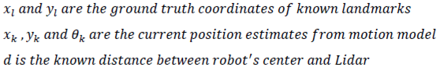
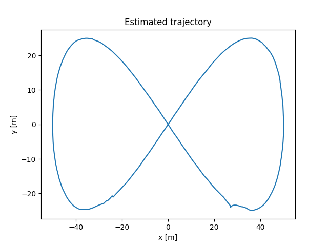

# __State estimation and localization for self-driving cars__

In this course, fundamental concepts in state estimation and localization for autonomous vehicles were covered. Many associated tools required in solving the state estimation problem were also taught.It started with least-squares technique which developed an insight regarding the problem of state estatimation and our approach towards it.Then, it moved on to various localization algorithms like Kalman filter,Extended Kalman filter and Unscented Kalman filter.Further modules were dedicated to formulation of sensor models for commonly used devices in autonomous driving such as Lidar,IMU,GNSS and wheel encoders.Finally a complete localization stack based on sensor fusion with EKF was developed in the final assignment which incorporated noisy recorded data from all sensors and estimated trajectory of the vehicle along with its uncertainty estimate.

## Extended Kalman Filter

Th extended Kalman filter is the non linear version of Kalman filter.A Kalman filter inherently exploits the properties of linear state space models with variables having Gaussian pdf.In case of localization of autonomous vehicles, it is required to make best possible use of all the noisy sensor data available.Kalman filter is one of the most popular choice when it comes to precise fusion of data from multiple sources. It works in two stages; the prediction step and the correction step. In prediction step, a motion model predicts the mean and covariance of random variables based on past estimate of the state and control inputs given.Then the sensor model evaluates the measurements to be expected based on our predicted state.In the correction step, the expected measurements are compared with actual measurements and then,the Kalman gain weighs accurately each of the above estimates depending upon their covariances and provides us with a more accurate guess of the current state with reduced uncertainty.
While dealing with non-linear models, they are first linearized with Taylor series approximation upto first order term and then processed by our basic Kalman filter algorithm.This modified version is nothing but our extended kalman filter.The workflow of extended kalman filter is represented below :

- Step 1:

	Prior estimate with non-linear motion model

	

## Result:

Ground-truth:

Estimated trajectory:

